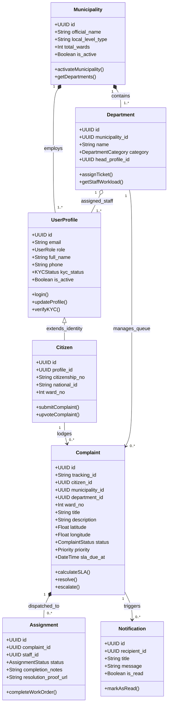
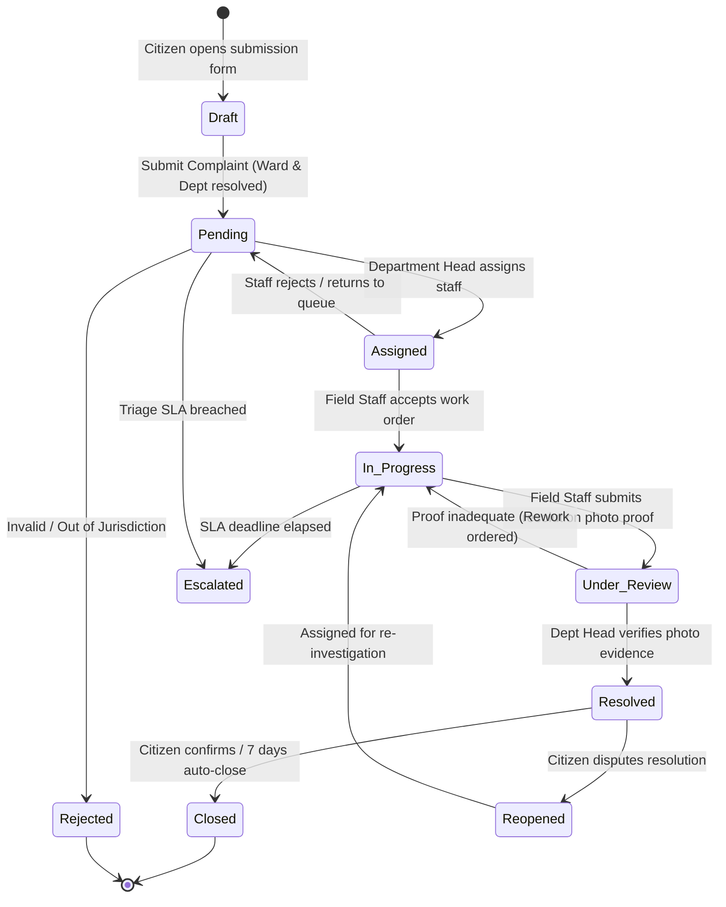
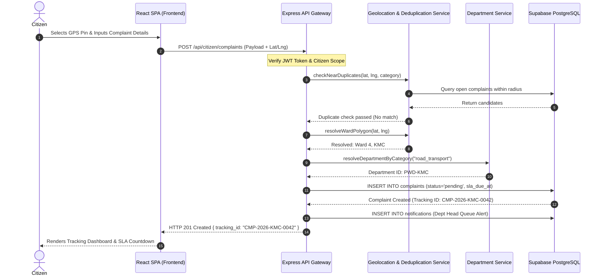
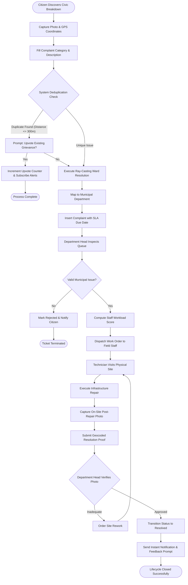
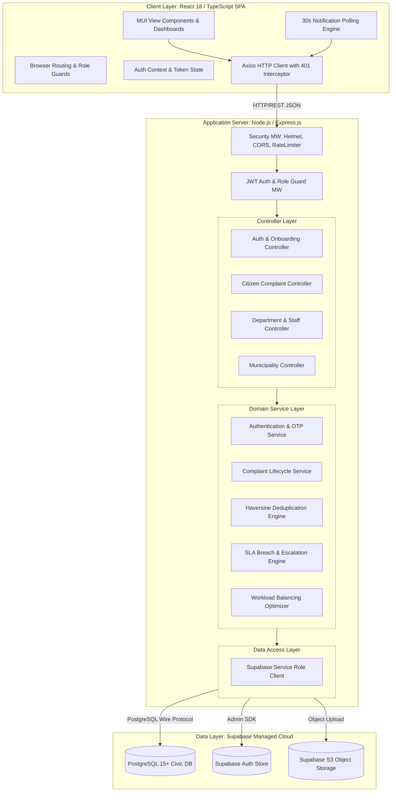

# Chapter 3: System Analysis and Design

---

## 3.1 / 8.1 System Analysis

System analysis is the systematic process of gathering, examining, and structuring requirements to understand what the proposed software system must accomplish and identify the operational constraints under which it must function.

---

### 3.1.1 / 8.1.1 Requirement Analysis

Requirement analysis establishes the contractual baseline for software engineering, classified into **Functional Requirements (FR)** and **Non-Functional Requirements (NFR)**.

---

#### i. Functional Requirements (Illustrated Using Use Case Diagram and Descriptions)

The Smart Civic Platform enforces a five-tier Role-Based Access Control (RBAC) architecture comprising:
1. **Citizen (*नगरबासी*)**
2. **Field Staff (*प्राविधिक कर्मचारी*)**
3. **Department Head (*शाखा प्रमुख*)**
4. **Municipality Head (*नगर प्रमुख / CAO*)**
5. **Superadmin (*केन्द्रीय प्रशासक*)**

##### A. System-Wide Use Case Diagram

```mermaid
flowchart TD
    subgraph Actors [System Stakeholders]
        C((Citizen))
        FS((Field Staff))
        DH((Department Head))
        MH((Municipality Head))
        SA((Superadmin))
    end

    subgraph Platform [Smart Civic Operating System]
        UC1[UC-01: Register & Submit KYC]
        UC2[UC-02: Lodge Geo-Tagged Complaint]
        UC3[UC-03: View & Upvote Nearby Duplicates]
        UC4[UC-04: Track Live Ticket & SLA Countdown]
        
        UC5[UC-05: Inspect Assigned Work Orders]
        UC6[UC-06: Upload Resolution Photo & Proof]
        
        UC7[UC-07: Review Queue & Re-route Tickets]
        UC8[UC-08: Workload-Balanced Staff Dispatch]
        UC9[UC-09: Monitor SLA Pre-Breach Warnings]
        
        UC10[UC-10: Municipal Executive Analytics]
        UC11[UC-11: Validate Citizen KYC Records]
        UC12[UC-12: Inter-Departmental Escalations]
        
        UC13[UC-13: Provision Municipalities across Nepal]
        UC14[UC-14: Audit Logs & Tenant Oversight]
    end

    C --> UC1
    C --> UC2
    C --> UC3
    C --> UC4

    FS --> UC5
    FS --> UC6

    DH --> UC7
    DH --> UC8
    DH --> UC9

    MH --> UC10
    MH --> UC11
    MH --> UC12

    SA --> UC13
    SA --> UC14
```



---

##### B. Detailed Use Case Descriptions

###### Use Case UC-02: Lodge Geo-Tagged Civic Complaint
* **Use Case ID:** UC-02
* **Use Case Name:** Lodge Geo-Tagged Civic Complaint
* **Primary Actor:** Citizen (*नगरबासी*)
* **Pre-conditions:** Citizen must be authenticated with an active session token. Unverified citizens are limited to at most 3 active concurrent pending complaints.
* **Trigger:** Citizen navigates to `/citizen/submit-complain` and clicks "Submit New Grievance."
* **Main Success Scenario:**
  1. Citizen opens the submission form.
  2. System queries the browser HTML5 Geolocation API; citizen pins exact physical location on the interactive map.
  3. System executes the Ray-Casting algorithm to automatically resolve the Municipality and Ward number.
  4. System runs the Spatiotemporal Deduplication algorithm against open tickets within a 300-meter radius.
  5. If no duplicate is detected, citizen enters title, description, category, and uploads photos.
  6. Citizen clicks "Submit."
  7. Backend maps category to the responsible municipal department, computes severity, assigns SLA due time, generates a unique tracking ID (e.g., `CMP-2026-KMC-0042`), and stores record in Supabase.
  8. System dispatches confirmation notification to citizen and places ticket in the department queue.
* **Alternative Flow (Duplicate Found):**
  * At Step 4, if a matching ticket within 300m exists, system renders: *"Similar issue reported 45m away. Would you like to Upvote instead?"* Citizen selects "Upvote (+1 Me Too)", which increments the counter and subscribes them to status updates without creating a redundant ticket.
* **Post-conditions:** Complaint is logged with status `pending`, assigned an SLA timestamp, and made visible on the departmental triage dashboard.

---

###### Use Case UC-06: Upload Resolution Photo & Submit Completion Proof
* **Use Case ID:** UC-06
* **Use Case Name:** Submit Resolution Proof and Close Field Assignment
* **Primary Actor:** Field Staff (*प्राविधिक कर्मचारी*)
* **Pre-conditions:** Technician must be assigned to the ticket, and ticket must be in `in_progress` status.
* **Trigger:** Field technician completes the physical maintenance repair on-site.
* **Main Success Scenario:**
  1. Staff accesses `/staff/complaints/:id` on a mobile browser.
  2. Staff inspects original citizen photograph and GPS coordinates.
  3. Staff clicks "Mark as Resolved" and uploads mandatory on-site post-repair photographs.
  4. Staff inputs mandatory field completion notes detailing actions taken.
  5. System validates image integrity and uploads binary to Supabase `complaint-media` storage bucket.
  6. System updates assignment status to `completed` and transitions complaint status to `resolved`.
  7. System records resolution timestamp and verifies SLA compliance.
  8. System sends instant in-app notification to the citizen prompting for feedback rating.
* **Exceptions:** If the staff attempts to submit resolution without uploading a photo, the backend rejects the transaction with HTTP 422 Unprocessable Entity (`resolution_proof_required`).

---

###### Use Case UC-08: Workload-Balanced Staff Dispatch
* **Use Case ID:** UC-08
* **Use Case Name:** Intelligent Staff Assignment
* **Primary Actor:** Department Head (*शाखा प्रमुख*)
* **Pre-conditions:** Complaint must be in `pending` or `under_review` status within the department queue.
* **Main Success Scenario:**
  1. Department Head views ticket details and clicks "Assign Field Personnel."
  2. Backend computes Multi-Criteria Decision Analysis (MCDA) scores across all active technicians in that department (weighting current active ticket load, geographical distance, and category skill match).
  3. UI displays recommended staff ranked by suitability score.
  4. Department Head confirms staff selection.
  5. System transitions ticket status to `assigned`, creates an `assignments` record, and issues an instant notification to the assigned technician's mobile dashboard.

---

#### ii. Non-Functional Requirements (NFR)

Non-functional requirements specify architectural qualities, operational limits, and security constraints:

| Dimension | Metric / Specification | Project Implementation Technique |
| :--- | :--- | :--- |
| **Performance** | API response latency $\le 500\text{ ms}$ for 95% of standard requests. | Node.js asynchronous non-blocking event loop; indexed PostgreSQL queries. |
| **Throughput** | Support $\ge 100$ concurrent user sessions per municipal instance. | Stateless JWT architecture; pooled database connections via Supabase. |
| **Polling Latency**| Real-time alerts delivered within $\le 30\text{ seconds}$. | Active window polling mechanism via React NotificationProvider. |
| **Security** | OWASP Top 10 compliance; role privilege escalation prevention. | Helmet security headers, CORS origin whitelisting, Express-Validator, Bcrypt ($N=10$), PostgreSQL Row-Level Security. |
| **Data Integrity** | ACID transactional compliance across all ticket state transitions. | PostgreSQL transactional consistency (`BEGIN ... COMMIT`) on ticket assignment and resolution. |
| **Usability** | Fully responsive across screen viewports from $360\text{px}$ (mobile) to $1920\text{px}$ (desktop). | Material UI (MUI) responsive grid breakpoints and touch-friendly UI design tokens. |
| **Availability** | $99.5\%$ operational uptime during municipal working hours. | Cloud-native deployment on high-availability containerized edge platforms. |
| **Scalability** | Multi-tenant horizontal scalability supporting all 753 Local Levels of Nepal. | Tenant-partitioned data schema (`municipality_id` scoping) and modular micro-services ready routing. |

---

### 3.1.2 / 8.1.2 Feasibility Analysis

A multidimensional feasibility study was conducted to evaluate project viability:

```text
 ┌─────────────────────────────────────────────────────────────────────────────┐
 │                         FEASIBILITY DIMENSIONS MATRIX                       │
 ├───────────────────┬─────────────────────────────────────────────────────────┤
 │ Feasibility Type  │ Evaluation & Project Alignment                          │
 ├───────────────────┼─────────────────────────────────────────────────────────┤
 │ Technical         │ HIGH: Built on proven, industry-standard stack          │
 │                   │ (React 18, TypeScript, Node.js, PostgreSQL/Supabase).   │
 ├───────────────────┼─────────────────────────────────────────────────────────┤
 │ Operational       │ HIGH: Seamlessly maps to Nepal's Local Government       │
 │                   │ Operation Act, 2074 (Ward -> Department -> Mayor).     │
 ├───────────────────┼─────────────────────────────────────────────────────────┤
 │ Economic          │ HIGH: Built 100% on open-source libraries and cloud     │
 │                   │ free tiers; zero upfront software licensing fees.       │
 ├───────────────────┼─────────────────────────────────────────────────────────┤
 │ Schedule          │ HIGH: Successfully engineered in 5 sequential Agile     │
 │                   │ sprints over an 8-week development timeline.            │
 └───────────────────┴─────────────────────────────────────────────────────────┘
```

#### i. Technical Feasibility
The platform utilizes modern, production-hardened web standards:
* **Frontend:** React 18, Vite, and TypeScript provide static type-checking and high runtime rendering efficiency.
* **Backend:** Node.js LTS with Express.js offers mature ecosystem libraries for cryptographic signing (`jsonwebtoken`), security (`helmet`, `cors`), and geometry (`geolib`).
* **Database:** Managed PostgreSQL via Supabase provides enterprise relational stability, geographic coordinate indexing, and built-in object storage.
* **Client Hardware Compatibility:** Compatible with standard Android and iOS mobile web browsers without requiring heavy app store downloads.

#### ii. Operational Feasibility
The system is intentionally modeled after the statutory administrative hierarchies of Nepal:
* Directly maps to the structural roles prescribed by the **Local Government Operation Act, 2074**: *Nagar Pramukh / CAO* (Municipality Head), *Sakha Pramukh* (Department Head), and *Technical Overseers* (Field Staff).
* Solves the acute operational problem of ward offices being disconnected from central engineering departments.
* Requires minimal digital literacy; the citizen interface relies on visual map pin-drops, category cards, and automated ward detection rather than complex bureaucratic form-filling.

#### iii. Economic Feasibility
Traditional commercial municipal platforms (e.g., SeeClickFix in the US) cost tens of thousands of dollars annually in proprietary vendor licensing. The Smart Civic Platform achieves near-zero software licensing overhead:
* **Operating System & Runtime:** Linux / Node.js (Open Source).
* **Database & Hosting:** Supabase Free/Pro tier and serverless deployment models provide ample throughput for municipal ward grievance volumes at minimal cost.
* **Return on Investment (ROI):** Delivers enormous operational cost savings by eliminating paper stationery, reducing manual data entry overhead, and optimizing field staff travel through route and workload balancing.

#### iv. Schedule Feasibility
The project was structured and delivered within an 8-week timeframe divided into five 2-week overlapping Agile sprints:
* **Weeks 1–2 (Sprint 1):** Domain research, PostgreSQL relational schema modeling, Supabase setup, and multi-tenant authentication.
* **Weeks 3–4 (Sprint 2):** Citizen grievance reporting pipeline, HTML5 GPS integration, and photo upload storage buckets.
* **Weeks 5–6 (Sprint 3 & 4):** Department queues, staff assignment logic, spatiotemporal deduplication, and predictive SLA engine.
* **Weeks 7–8 (Sprint 5 & QA):** Executive analytics, Superadmin portal, API testing suite execution, and documentation.

---

### 3.1.3 / 8.1.3 Object Modelling Using Class and Object Diagrams

#### A. Class Diagram
The class diagram captures the static structural model of the platform, illustrating entity attributes, methods, and relational cardinalities:



---

#### B. Object Diagram (Runtime Instance Model)
The object diagram captures a concrete runtime state of the system during an active civic incident in Kathmandu:

```mermaid
objectDiagram
    object "kmc : Municipality" {
        id = "9b1deb4d-3b7d-4bad-9bdd-2b0d7b3dcb6d"
        official_name = "Kathmandu Metropolitan City"
        local_level_type = "metropolitan_city"
        total_wards = 32
        is_active = true
    }

    object "pwd : Department" {
        id = "4f8a9e12-c512-4211-9a1b-312984102911"
        name = "Infrastructure Development Branch"
        category = "road_transport"
    }

    object "citizenRajan : Citizen" {
        id = "11223344-5566-7788-99aa-bbccddeeff00"
        full_name = "Rajan Shrestha"
        ward_no = 4
        citizenship_no = "27-01-78-12345"
        kyc_status = "verified"
    }

    object "complaint042 : Complaint" {
        id = "cc112233-4455-6677-8899-aabbccddeeff"
        tracking_id = "CMP-2026-KMC-0042"
        title = "Severe Pothole on Baluwatar Main Road"
        latitude = 27.7258
        longitude = 85.3312
        ward_no = 4
        status = "in_progress"
        priority = "high"
        sla_due_at = "2026-09-10T14:00:00Z"
    }

    object "overseerSunil : UserProfile" {
        id = "55667788-99aa-bbcc-ddee-ff0011223344"
        full_name = "Sunil Adhikari (Overseer)"
        role = "staff"
        is_active = true
    }

    object "assign042 : Assignment" {
        id = "8899aabb-ccdd-eeff-0011-223344556677"
        status = "in_progress"
    }

    kmc .. pwd
    pwd .. overseerSunil
    citizenRajan .. complaint042
    pwd .. complaint042
    complaint042 .. assign042
    overseerSunil .. assign042
```

---

### 3.1.4 / 8.1.4 Dynamic Modelling Using State and Sequence Diagrams

#### A. State Diagram: Complaint Lifecycle
The state diagram illustrates all possible operational states of a civic grievance and the trigger conditions governing status transitions:



---

#### B. Sequence Diagram: End-to-End Grievance Submission and Dispatch
The sequence diagram demonstrates the chronological message exchange between actors, client, API controllers, services, and the database:



---

### 3.1.5 / 8.1.5 Process Modelling Using Activity Diagrams

The activity diagram models the operational business process across the three primary human stakeholders and automated system engines:



---

## 3.2 / 8.2 System Design

System design translates the analytical models into concrete architectural components, physical network topologies, and technical interfaces.

---

### 3.2.1 / 8.2.1 Refinement of Design Models & Architectural Patterns

To maintain enterprise maintainability and testability, the system refines the initial models using standard design patterns:

1. **Layered Repository Pattern:** Isolates database query mechanics from domain business logic. If the underlying data layer is modified, service layer business rules remain unaltered.
2. **Data Transfer Object (DTO) Pattern:** Enforces strict compile-time TypeScript interfaces and runtime schema validation via `express-validator`, guaranteeing that malformed client payloads are rejected at the application perimeter.
3. **Observer / Pub-Sub Pattern for Notifications:** Decouples core state transitions (e.g., ticket assignment, SLA breach) from notification dispatch. When a ticket changes state, an asynchronous event triggers notification workers without blocking the main HTTP execution thread.
4. **Strategy Pattern for Severity & SLA Calculation:** Encapsulates severity scoring rules into interchangeable strategy modules, allowing municipalities to dynamically configure distinct SLA thresholds for urban vs. rural wards.

---

### 3.2.2 / 8.2.2 Component Diagram

The component diagram illustrates the high-level software modules, their structural interfaces, and internal dependencies:



---

### 3.2.3 / 8.2.3 Deployment Diagram

The deployment diagram illustrates the physical hardware and cloud execution environment hosting the platform:

```mermaid
deploymentdiagram
    node ClientDevice [Client Tier: Citizen & Municipal Terminals] {
        artifact Browser [Modern Web Browser\nChrome, Firefox, Safari, Edge]
    }

    node EdgeNetwork [Edge Infrastructure: CDN & DNS] {
        node Cloudflare [Cloudflare / Vercel Edge CDN] {
            artifact StaticAssets [Pre-bundled React 18 SPA\nHTML / CSS / Minified JS]
        }
    }

    node ApplicationServer [Application Tier: Node.js Cloud Runtime] {
        node DockerContainer [Docker Container / Linux VM] {
            component ExpressServer [Express.js REST API Server\nNode.js LTS - Port 3000]
            component ProcessManager [PM2 Process Manager / Clustering]
        }
    }

    node SupabaseCloud [Managed Database Tier: Supabase Cloud] {
        node DBInstance [Managed PostgreSQL Instance] {
            database CivicDB [(PostgreSQL 15+\nTables, Views, Functions, RLS)]
        }
        node StorageInstance [Cloud Object Storage] {
            database S3Buckets [(Media Storage\ncomplaint-media & identity-docs)]
        }
        node AuthInstance [Authentication Service] {
            component GoTrue [GoTrue Auth Engine\nJWT Signing & Session Handling]
        }
    }

    Browser -- "HTTPS / TLS 1.3 (Port 443)" --> Cloudflare
    Browser -- "HTTPS / JSON REST API (Port 443)" --> ExpressServer
    ExpressServer -- "TLS Encrypted Connection (Port 5432)" --> CivicDB
    ExpressServer -- "HTTPS REST Storage API" --> S3Buckets
    ExpressServer -- "JWT Verification" --> GoTrue
```

---

## 3.3 / 8.3 Algorithm Details

The platform integrates four core algorithms to deliver automated civic intelligence:

---

### Algorithm 1: Spatiotemporal Near-Duplicate Complaint Detection & Upvoting

* **Problem Formulation:** When a major civic issue occurs (e.g., a burst water main), multiple citizens submit redundant complaints. Duplicate tickets choke department queues and divide citizen engagement.
* **Mechanism:** Evaluates geographic distance using the **Haversine Formula** combined with **Word N-Gram Cosine Similarity** within a sliding temporal window of $T = 72\text{ hours}$.

```text
Algorithm 1: Spatiotemporal Deduplication
Input:  New Complaint C_new (lat, lng, title, description, category, municipality_id)
Output: Candidate Duplicate List D_candidates

1. candidates = Query open complaints in database WHERE:
       municipality_id == C_new.municipality_id AND
       category == C_new.category AND
       status IN ('pending', 'assigned', 'in_progress') AND
       created_at >= (NOW() - INTERVAL '72 hours')

2. D_candidates = Empty List

3. FOR EACH complaint C_open IN candidates DO:
       d = CalculateHaversineDistance(C_new.lat, C_new.lng, C_open.lat, C_open.lng)
       IF d <= 300.0 meters THEN:
           text_sim = CalculateCosineSimilarity(C_new.title + C_new.desc, C_open.title + C_open.desc)
           IF text_sim >= 0.55 THEN:
               Append { ticket: C_open, distance: d, similarity: text_sim } TO D_candidates
           END IF
       END IF
   END FOR

4. Sort D_candidates by distance ASC
5. RETURN D_candidates
```

---

### Algorithm 2: Point-in-Polygon (Ray-Casting) Ward Jurisdiction Resolver

* **Problem Formulation:** Citizens often do not know which administrative ward boundary their current physical location falls under, leading to incorrect manual ward selection.
* **Mechanism:** Uses the **Jordan Curve Theorem (Ray-Casting)** to mathematically determine whether a coordinate $P(x, y)$ resides inside a closed ward polygon boundary.

```text
Algorithm 2: Ray-Casting Ward Resolver
Input:  Coordinate Point P(lat, lng), Ward Polygon Vertices V = [(x_1, y_1), ..., (x_n, y_n)]
Output: Boolean (True if P is inside the Ward, False otherwise)

1. is_inside = False
2. n = Length(V)
3. j = n - 1

4. FOR i = 0 TO n - 1 DO:
       IF ((V[i].lat > P.lat) != (V[j].lat > P.lat)) AND
          (P.lng < (V[j].lng - V[i].lng) * (P.lat - V[i].lat) / (V[j].lat - V[i].lat) + V[i].lng) THEN:
           is_inside = NOT is_inside
       END IF
       j = i
   END FOR

5. RETURN is_inside
```

---

### Algorithm 3: Automated Complaint Severity & SLA Due-Time Calculator

* **Problem Formulation:** Subjective priority assignment by citizens leads to either under-prioritizing critical hazards or marking every minor inconvenience as "Urgent."
* **Mechanism:** Computes a composite severity score based on infrastructural safety keywords, category weight, and community upvote velocity, and dynamically assigns statutory SLA deadlines:

```text
Algorithm 3: Severity Scoring and SLA Assignment
Input:  Complaint Text, Category, UpvoteCount
Output: Severity Priority Enum (Urgent, High, Medium, Low), SLA Due Timestamp

1. hazard_keywords = ["fire", "spark", "electric wire", "drain collapse", "pipe burst", "flood", "sewage leak", "casualty"]
2. score = 0

3. IF ContainsAnyKeyword(ComplaintText, hazard_keywords) THEN:
       score = score + 50
   END IF

4. IF Category IN ('electricity', 'water_supply', 'disaster_management') THEN:
       score = score + 30
   ELSE IF Category IN ('road_transport', 'sanitation') THEN:
       score = score + 20
   ELSE:
       score = score + 10
   END IF

5. score = score + Min(UpvoteCount * 5, 20)

6. IF score >= 75 THEN:
       priority = 'urgent'
       sla_hours = 24
   ELSE IF score >= 50 THEN:
       priority = 'high'
       sla_hours = 48
   ELSE IF score >= 30 THEN:
       priority = 'medium'
       sla_hours = 72
   ELSE:
       priority = 'low'
       sla_hours = 120
   END IF

7. sla_due_at = CurrentTimestamp() + (sla_hours * 3600 seconds)
8. RETURN { priority, sla_due_at }
```

---

### Algorithm 4: Multi-Criteria Workload-Balanced Staff Dispatch Optimization

* **Problem Formulation:** Department heads manually assigning work orders frequently overload specific technicians while others remain idle, increasing response times and travel costs.
* **Mechanism:** Ranks available technicians using a multi-criteria weighted utility function balancing current backlog, Euclidean distance, and category specialization.

```text
Algorithm 4: Workload-Balanced Staff Dispatch
Input:  Complaint Location P_complain, Department Staff List S, Weights w_load=0.45, w_dist=0.35, w_skill=0.20
Output: Best Staff Candidate S_best

1. max_load = 10  // Maximum concurrent tickets allowed per technician
2. max_dist = 15.0 km // Maximum service radius

3. FOR EACH staff s IN S DO:
       IF s.status != 'active' OR s.active_tickets >= max_load THEN:
           s.suitability_score = -1.0  // Ineligible
           CONTINUE
       END IF

       normalized_load_score = 1.0 - (s.active_tickets / max_load)
       distance_km = CalculateHaversineDistance(P_complain, s.current_location)
       normalized_dist_score = 1.0 - Min(distance_km / max_dist, 1.0)
       skill_score = (s.specialty == ComplaintCategory) ? 1.0 : 0.4

       s.suitability_score = (w_load * normalized_load_score) + 
                             (w_dist * normalized_dist_score) + 
                             (w_skill * skill_score)
   END FOR

4. Filter out staff with suitability_score == -1.0
5. S_best = Staff with MAX(suitability_score)
6. RETURN S_best
```
