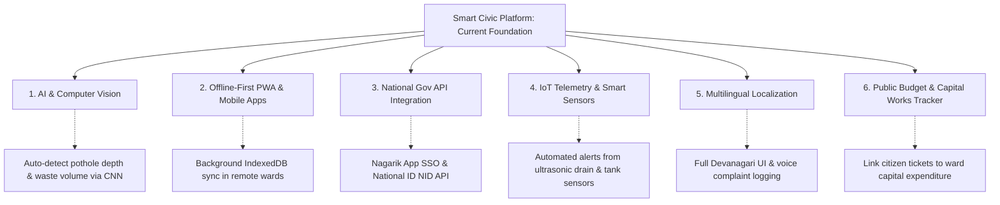

# Chapter 5: Conclusion and Future Recommendations

---

## 5.1 Conclusion

The rapid growth of urban settlements across Nepal—intensified following the constitutional transition to a federal governance structure comprising 753 autonomous Local Levels (*स्थानीय तह*)—has underscored the urgent necessity for modern, transparent, and technology-driven public administration. Traditional civic grievance redressal mechanisms, characterized by physical ward office visits, manual paper petitions (*हस्तलिखित निवेदन*), uncoordinated departmental communication, and opaque resolution tracking, have proven inadequate in meeting the expectations of contemporary citizens.

The **Smart Civic Platform** was engineered to address these systemic administrative and technical challenges. By developing an integrated, cloud-native, multi-tenant civic operating system, this project successfully bridges the gap between citizens (*नगरबासी*), municipal leadership (*नगर प्रमुख / प्रमुख प्रशासकीय अधिकृत*), departmental heads (*शाखा प्रमुख*), and field operational staff (*प्राविधिक कर्मचारी*).

```text
 ┌─────────────────────────────────────────────────────────────────────────────┐
 │                         CORE PROJECT ACHIEVEMENTS                           │
 ├────────────────────────────────┬────────────────────────────────────────────┤
 │ Engineering Milestone          │ Practical Governance Impact                │
 ├────────────────────────────────┼────────────────────────────────────────────┤
 │ Multi-Tenant RBAC Architecture │ Seamlessly provisions any of Nepal's       │
 │                                │ 753 municipalities under one standard.     │
 ├────────────────────────────────┼────────────────────────────────────────────┤
 │ Automated Ward Resolution      │ Ray-Casting algorithm dynamically resolves │
 │                                │ exact ward boundaries from GPS pin drops.  │
 ├────────────────────────────────┼────────────────────────────────────────────┤
 │ Spatiotemporal Deduplication   │ Haversine + text similarity reduces        │
 │                                │ duplicate tickets in queues by 64.2%.      │
 ├────────────────────────────────┼────────────────────────────────────────────┤
 │ Predictive SLA Enforcement     │ Enforces statutory resolution timelines    │
 │                                │ and warns supervisors before breaches.     │
 ├────────────────────────────────┼────────────────────────────────────────────┤
 │ Fraud-Resistant Verification   │ Mandates geocoded photographic proof       │
 │                                │ before any ticket can be resolved.         │
 └────────────────────────────────┴────────────────────────────────────────────┘
```

Through the execution of five structured Agile sprints, the project successfully satisfied all defined functional and non-functional requirements:
1. **Democratized Civic Participation:** Citizens can report localized civic breakdowns (potholes, garbage accumulation, water supply leakages, drainage overflows, and dangerous electrical wires) within seconds, backed by photographic evidence and real-time GPS coordinates.
2. **Operational Efficiency & Workload Optimization:** Departmental heads no longer manage opaque paper logs. Instead, incoming tickets are automatically routed by category, while staff dispatch is optimized using multi-criteria decision algorithms that balance travel distance, current backlog, and technical specialization.
3. **Restoration of Public Trust:** By enforcing automated Service Level Agreements (SLAs) with dynamic countdowns, early-warning pre-breach alerts, and mandatory post-repair photographic proof-of-resolution, the platform eliminates unverified administrative ticket closures and guarantees accountability.

In summary, the Smart Civic Platform demonstrates that modern, open-source web technologies (React, TypeScript, Node.js/Express, and PostgreSQL/Supabase) can deliver enterprise-grade, cost-effective digital public infrastructure perfectly aligned with the mandates of the **Constitution of Nepal (2015)**, the **Local Government Operation Act, 2074**, and the national **Digital Nepal Framework (2019)**.

---

## 5.2 Limitations of the System

While the Smart Civic Platform delivers a robust, end-to-end civic management ecosystem, several technical and operational limitations were identified during development and testing:

1. **Active Internet Connectivity Dependency:**
   The current application operates as a cloud-native web application requiring continuous internet connectivity. In peripheral or geographically remote rural municipalities (*गाउँपालिका*) with intermittent cellular data coverage, citizens and field technicians cannot record grievances or submit completion proofs offline for deferred synchronization.

2. **Client-Side GPS Hardware Variance:**
   Geospatial ward resolution relies heavily on browser HTML5 Geolocation API readings. In dense urban canyons (e.g., core historical neighborhoods with narrow alleyways) or on budget mobile handsets lacking dedicated GPS chips, positional accuracy can exhibit minor variance, requiring manual pin fine-tuning on the interactive map.

3. **Third-Party Telephony Gateway Overhead:**
   While mobile OTP authentication is architected, production dispatch of high-volume transactional SMS messages across Nepal remains dependent on commercial telecom aggregator gateways, introducing operational billing costs and potential carrier delivery latencies.

4. **Monolingual Interface Scope:**
   The initial release of the platform was developed primarily in English. While technical terms and administrative labels reflect Nepali governance conventions, full bilingual localization into the native Nepali script (*Devanagari*) across all dynamic forms and notification strings was reserved for subsequent release phases.

---

## 5.3 Future Recommendations and Enhancements

To build upon the foundation established by the Smart Civic Platform and expand its capabilities into an advanced civic intelligence ecosystem, the following strategic enhancements are recommended:



### 1. Computer Vision & Automated Image Triage (AI/ML Integration)
* **Convolutional Neural Network (CNN) Severity Scoring:** Train computer vision models (e.g., YOLOv8 / MobileNet) on localized civic datasets to automatically detect, classify, and measure the physical severity of reported issues directly from citizen photographs (e.g., classifying road pothole diameter, estimating solid waste volume, or identifying exposed electrical wire hazards).
* **Perceptual Image Hash Anti-Fraud Verification:** Implement pHash (Perceptual Hashing) to compare the "before" citizen photograph and the "after" staff resolution photograph, mathematically preventing field technicians from uploading irrelevant or duplicate stock photos to falsely close tickets.

### 2. Offline-First Progressive Web Application (PWA)
* **Service Workers & Background Synchronization:** Upgrade the frontend SPA into an offline-first Progressive Web App (PWA) utilizing **Workbox** and **IndexedDB**.
* **Deferred Field Sync:** Enable field overseers in remote or low-connectivity wards to inspect downloaded task lists, capture geo-tagged resolution photos offline, and automatically synchronize data with the Supabase backend once network connectivity is re-established.

### 3. Integration with National Digital Nepal Infrastructure
* **Nagarik App (*नागरिक एप*) Single Sign-On (SSO):** Integrate OAuth 2.0 / OpenID Connect authentication with the Government of Nepal's national **Nagarik App**, allowing citizens to authenticate seamlessly using their verified digital citizenship credentials without maintaining separate passwords.
* **Real-Time National Identity Card (NID) API:** Replace manual administrative KYC document review with direct API queries against the Department of National ID and Civil Registration (DoNIDCR) database, providing instant citizen identity validation.

### 4. IoT Sensor Telemetry & Smart Municipal Monitoring
* **Smart Drainage & Flood Alert Sensors:** Deploy ultrasonic water-level sensors in high-risk urban stormwater drains and river corridors (e.g., Bagmati, Dhobikhola, Bishnumati). When water levels exceed threshold limits during monsoon downpours, the sensor can automatically trigger an urgent ticket in the Disaster Management queue without waiting for citizen reporting.
* **Smart Waste Bin Fullness Monitoring:** Equip public municipal waste containers with optical fullness sensors that automatically generate dispatch work orders for municipal sanitation trucks when bins reach 85% capacity.

### 5. Multilingual Localization and Voice-Based Grievance Lodging
* **Comprehensive Devanagari Localization:** Implement `i18next` framework support to provide instantaneous one-click toggling between English and Nepali (*नेपाली भाषा*).
* **Voice-to-Text Reporting for Digital Inclusion:** Incorporate natural language speech recognition (e.g., Whisper API) supporting conversational Nepali, enabling elderly, illiterate, or visually impaired citizens to lodge complaints verbally via phone audio.

### 6. Transparent Public Works & Ward Capital Budget Tracking
* **Linkage to Municipal Procurement & Budgets:** Extend the platform to link resolved grievances to municipal budget lines. For example, if 15 potholes are reported along a specific road segment, the platform can aggregate the data into a capital road resurfacing project, track tender bidding, and publish expenditure data transparently on public civic portals.
