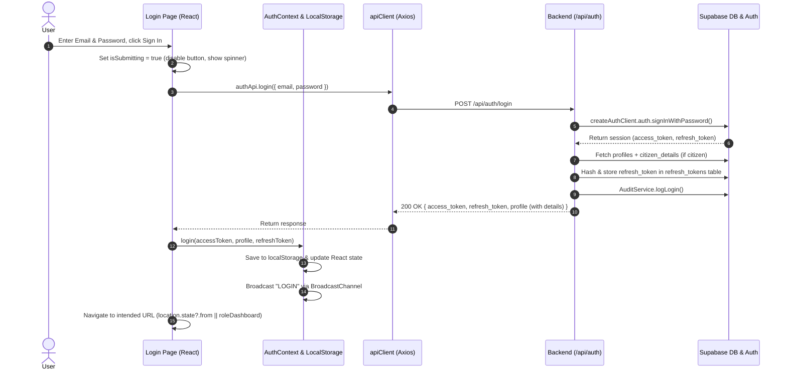
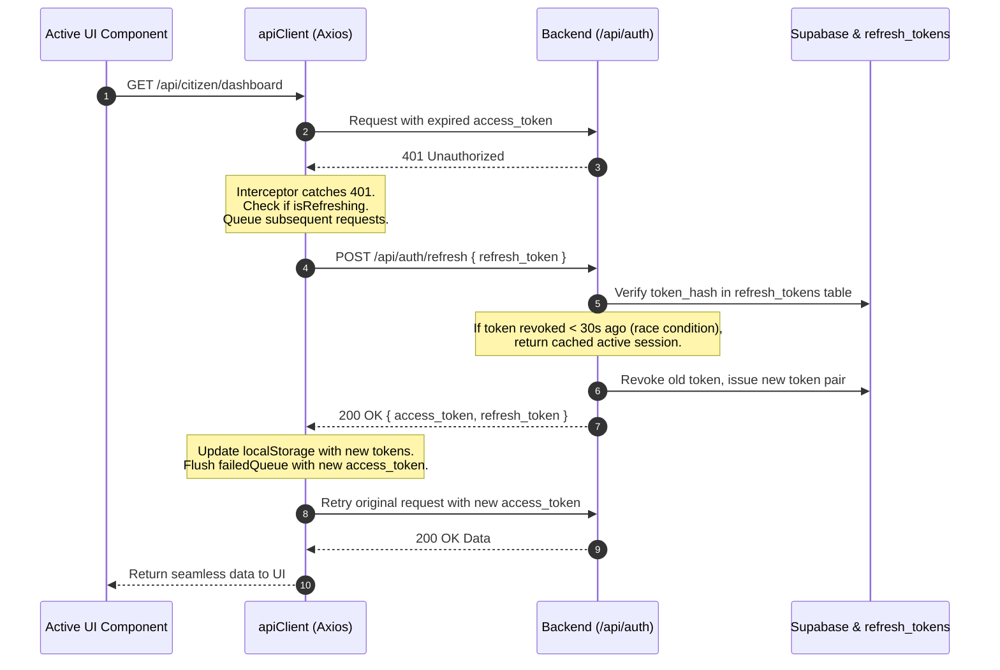
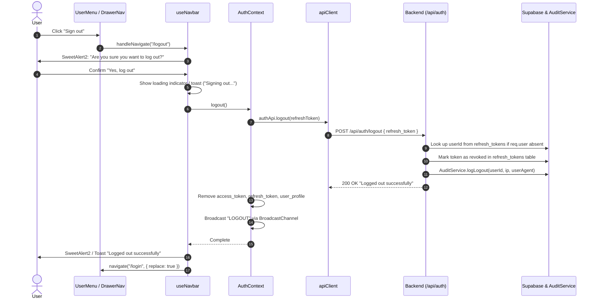

# Authentication (Login / Logout) Architecture Analysis & Smooth Flow Implementation Plan

## 1. Executive Summary

This document presents a comprehensive technical audit of the authentication (Login, Token Refresh, Session Maintenance, and Logout) mechanisms across the **Smart Civic Platform** (Backend & Frontend). 

While the core foundation is built using modern paradigms (Supabase Auth, JWT Bearer tokens, token rotation in a custom `refresh_tokens` table, and React Context state), our deep-dive analysis has identified **critical discrepancies, race conditions, and UX friction points** that cause abrupt logouts, token refresh failures, stale user permissions, missing audit entries, and multi-tab synchronization desyncs.

This document breaks down every current issue with file and line references, illustrates the exact lifecycle flows, and outlines actionable solutions to make the login and logout experience silky smooth and resilient.

---

## 2. Architecture & File Inventory

### 2.1 Backend (`Smart_Civic_Platform_Backend`)

| File Path | Role in Auth Mechanism |
| :--- | :--- |
| [`src/config/supabase.ts`](file:///d:/Smart-Civic-Platform/Smart_Civic_Platform_Backend/src/config/supabase.ts) | Exports `supabase` (Anon client), `supabaseAdmin` (Service Role client), `createUserClient` (per-request RLS client), and `createAuthClient` (ephemeral credentials client). |
| [`src/modules/auth/routes/auth.routes.ts`](file:///d:/Smart-Civic-Platform/Smart_Civic_Platform_Backend/src/modules/auth/routes/auth.routes.ts) | Express routes for `/register`, `/login`, `/login-mobile`, `/send-otp`, `/verify-otp`, `/refresh`, `/logout`, `/me`, and `/change-password`. |
| [`src/modules/auth/controller/auth.controller.ts`](file:///d:/Smart-Civic-Platform/Smart_Civic_Platform_Backend/src/modules/auth/controller/auth.controller.ts) | HTTP request handlers; handles headers, client metadata (IP, user-agent), request payloads, and standard response wrapping (`sendSuccess`, `sendError`). |
| [`src/modules/auth/services/auth.service.ts`](file:///d:/Smart-Civic-Platform/Smart_Civic_Platform_Backend/src/modules/auth/services/auth.service.ts) | Business logic: `loginService`, `refreshTokenService`, `logoutService`, `loginWithMobileService`, `registerService`, `changePasswordService`. Manages DB `refresh_tokens` hashing and Supabase session interactions. |
| [`src/middleware/authenticate.ts`](file:///d:/Smart-Civic-Platform/Smart_Civic_Platform_Backend/src/middleware/authenticate.ts) | `authenticate` (strict JWT verification) and `optionalAuthenticate` (tolerant JWT extraction for non-blocking routes like `/logout`). |
| [`src/middleware/validateBody.ts`](file:///d:/Smart-Civic-Platform/Smart_Civic_Platform_Backend/src/middleware/validateBody.ts) | Zod schema validator middleware: parses `req.body` and overwrites `req.body = result.data`. |
| [`src/validation/auth.validation.ts`](file:///d:/Smart-Civic-Platform/Smart_Civic_Platform_Backend/src/validation/auth.validation.ts) | Zod validation schemas (`loginSchema`, `refreshTokenSchema`, `logoutSchema`, `loginMobileSchema`, etc.). |
| [`src/service/audit.service.ts`](file:///d:/Smart-Civic-Platform/Smart_Civic_Platform_Backend/src/service/audit.service.ts) | Records security events in DB (`LOGIN`, `LOGOUT`, IP address, user-agent, timestamp). |

### 2.2 Frontend (`Smart_Civic_Platform_Frontend`)

| File Path | Role in Auth Mechanism |
| :--- | :--- |
| [`src/components/layout/AuthContext.tsx`](file:///d:/Smart-Civic-Platform/Smart_Civic_Platform_Frontend/src/components/layout/AuthContext.tsx) | React Context Provider: stores `user`, `isAuthenticated`, `kycCompleted`, and exposes `login()` and `logout()`. Reads initial state from `localStorage.getItem("user_profile")`. |
| [`src/hooks/useAuth.ts`](file:///d:/Smart-Civic-Platform/Smart_Civic_Platform_Frontend/src/hooks/useAuth.ts) | Hook consuming `AuthContext` and defines `UserProfile` interface. |
| [`src/api/client.ts`](file:///d:/Smart-Civic-Platform/Smart_Civic_Platform_Frontend/src/api/client.ts) | Axios client instance with request interceptor (attaches `Bearer ${accessToken}`) and response interceptor (handles 401 automatic token refresh with a concurrency promise queue and `clearAuthAndRedirect`). |
| [`src/api/modules/auth.api.ts`](file:///d:/Smart-Civic-Platform/Smart_Civic_Platform_Frontend/src/api/modules/auth.api.ts) | API methods for auth endpoints: `login`, `loginWithMobile`, `refresh`, `logout`, `getMe`, `changePassword`, etc. |
| [`src/api/index.ts`](file:///d:/Smart-Civic-Platform/Smart_Civic_Platform_Frontend/src/api/index.ts) | Exports centralized API modules and legacy `fetchWithAuth` wrapper. |
| [`src/pages/auth/Login.tsx`](file:///d:/Smart-Civic-Platform/Smart_Civic_Platform_Frontend/src/pages/auth/Login.tsx) | Login UI (email/password form using Formik + Yup), wrapped with `withRoleRedirect`. |
| [`src/pages/auth/withRoleRedirect.tsx`](file:///d:/Smart-Civic-Platform/Smart_Civic_Platform_Frontend/src/pages/auth/withRoleRedirect.tsx) | HOC that redirects authenticated users to their corresponding dashboard based on `user.role`, `force_password_reset`, and KYC status. |
| [`src/routes/ProtectedRoute.tsx`](file:///d:/Smart-Civic-Platform/Smart_Civic_Platform_Frontend/src/routes/ProtectedRoute.tsx) | Route guard verifying authentication, mandatory password reset, mandatory KYC for staff/admins, and role-based access control. |
| [`src/hooks/useNavbar.ts`](file:///d:/Smart-Civic-Platform/Smart_Civic_Platform_Frontend/src/hooks/useNavbar.ts) | Navbar navigation logic: intercepts `/logout` click, prompts SweetAlert2 confirmation dialog, invokes `logout()`, and navigates to `/login`. |
| [`src/components/Navbar/UserMenu.tsx`](file:///d:/Smart-Civic-Platform/Smart_Civic_Platform_Frontend/src/components/Navbar/UserMenu.tsx) | User avatar dropdown menu containing profile info and the "Sign out" menu item. |

---

## 3. In-Depth Analysis of Current Issues & Failure Modes

### Issue 1: Missing `citizen_details` on Citizen Login (KYC Mismatch)
* **Locations:**
  * Backend: [`src/modules/auth/services/auth.service.ts` (Lines 226-232, 351-356)](file:///d:/Smart-Civic-Platform/Smart_Civic_Platform_Backend/src/modules/auth/services/auth.service.ts#L226-L232)
  * Backend: [`src/modules/auth/controller/auth.controller.ts` (Lines 117-167)](file:///d:/Smart-Civic-Platform/Smart_Civic_Platform_Backend/src/modules/auth/controller/auth.controller.ts#L117-L167)
  * Frontend: [`src/components/layout/AuthContext.tsx` (Lines 39-46)](file:///d:/Smart-Civic-Platform/Smart_Civic_Platform_Frontend/src/components/layout/AuthContext.tsx#L39-L46)
* **What Happens:**
  1. In `auth.controller.ts`, the `/me` endpoint fetches `citizen_details` from the `citizens` table and injects it into the returned profile.
  2. However, in `loginService` (`auth.service.ts`), only the `profiles` table is queried. It returns `profile` **without `citizen_details`**.
  3. When a citizen logs in, `AuthContext` sets `user` in `localStorage` without `citizen_details`.
  4. In `AuthContext.tsx`:
     ```ts
     const kycCompleted = user
       ? user.role === "citizen"
         ? user.citizen_details?.kyc_status === "verified"
         : ...
     ```
     Because `user.citizen_details` is `undefined`, `kycCompleted` evaluates to `false` for every citizen upon login, even if their KYC is officially verified in the database!
* **Consequence:** Citizen profile views, submission gates, and KYC status indicators show unverified/empty data right after login.

---

### Issue 2: No Initial Session Hydration / `/auth/me` Validation on App Load
* **Locations:**
  * Frontend: [`src/components/layout/AuthContext.tsx` (Lines 7-11)](file:///d:/Smart-Civic-Platform/Smart_Civic_Platform_Frontend/src/components/layout/AuthContext.tsx#L7-L11)
  * Frontend: [`src/api/modules/auth.api.ts` (Line 68)](file:///d:/Smart-Civic-Platform/Smart_Civic_Platform_Frontend/src/api/modules/auth.api.ts#L68)
* **What Happens:**
  1. `AuthContext` initializes state strictly from `localStorage.getItem("user_profile")`.
  2. There is **no `useEffect`** on app mount to call `authApi.getMe()` to revalidate the session with the server.
  3. In fact, `authApi.getMe` is never called anywhere in the entire frontend (except on one profile tab).
* **Consequence:**
  * If an administrator changes a user's role, deactivates/suspends their account, or approves their KYC, the frontend **never reflects the update** until the user manually logs out and logs back in.
  * If the token was invalidated or deleted server-side, the user still sees the authenticated shell until a background query throws a 401 error.

---

### Issue 3: Inconsistent KYC Condition Between `AuthContext` and `withRoleRedirect`
* **Locations:**
  * Frontend: [`src/components/layout/AuthContext.tsx` (Lines 42-45)](file:///d:/Smart-Civic-Platform/Smart_Civic_Platform_Frontend/src/components/layout/AuthContext.tsx#L42-L45)
  * Frontend: [`src/pages/auth/withRoleRedirect.tsx` (Lines 22)](file:///d:/Smart-Civic-Platform/Smart_Civic_Platform_Frontend/src/pages/auth/withRoleRedirect.tsx#L22)
* **The Conflict:**
  * In `AuthContext.tsx`:
    ```ts
    kycCompleted = Boolean(
      user.identity_document_url ||
      (user.identity_type && user.identity_number)
    )
    ```
  * In `withRoleRedirect.tsx`:
    ```ts
    const kycCompleted = Boolean(
      user.identity_type && user.identity_number && user.identity_document_url
    );
    ```
* **Consequence:**
  * `AuthContext` uses **OR (`||`)**, while `withRoleRedirect` uses **AND (`&&`)**.
  * A staff member or department head with identity number/type but pending document upload will be considered `kycCompleted: true` by `AuthContext` and `ProtectedRoute`, but `withRoleRedirect` considers them incomplete and attempts to redirect them to `/kyc`, creating inconsistent routing and potential redirect loops.

---

### Issue 4: Intended URL Lost on Login (Deep Linking / Redirect Preservation)
* **Locations:**
  * Frontend: [`src/routes/ProtectedRoute.tsx` (Line 14)](file:///d:/Smart-Civic-Platform/Smart_Civic_Platform_Frontend/src/routes/ProtectedRoute.tsx#L14)
  * Frontend: [`src/pages/auth/withRoleRedirect.tsx` (Lines 30-48)](file:///d:/Smart-Civic-Platform/Smart_Civic_Platform_Frontend/src/pages/auth/withRoleRedirect.tsx#L30-L48)
* **What Happens:**
  1. When an unauthenticated user navigates to a specific deep link (e.g., `/citizen/complaints/cm7xyz` or `/municipality_head/complaint-detail/123`), `ProtectedRoute` does:
     ```tsx
     return <Navigate to="/login" replace />;
     ```
     It **does not pass `state={{ from: location }}`**.
  2. Upon successful login, `withRoleRedirect` ignores the original destination and strictly routes the user to their default landing page (e.g., `/citizen/dashboard`).
* **Consequence:** Users lose their place when following shared links, email notifications, or bookmarks when logged out.

---

### Issue 5: CamelCase vs Snake_Case Discrepancy in `auth.api.ts` (`refresh`)
* **Locations:**
  * Frontend: [`src/api/modules/auth.api.ts` (Lines 60-63)](file:///d:/Smart-Civic-Platform/Smart_Civic_Platform_Frontend/src/api/modules/auth.api.ts#L60-L63)
  * Backend: [`src/validation/auth.validation.ts` (Lines 97-99)](file:///d:/Smart-Civic-Platform/Smart_Civic_Platform_Backend/src/validation/auth.validation.ts#L97-L99)
* **What Happens:**
  1. In `auth.api.ts`:
     ```ts
     refresh: async (refreshToken: string) => {
       const response = await apiClient.post('/auth/refresh', { refreshToken }); // <--- camelCase
       return response.data;
     }
     ```
  2. Backend `refreshTokenSchema` enforces:
     ```ts
     export const refreshTokenSchema = z.object({
       refresh_token: z.string().min(1), // <--- snake_case required!
     });
     ```
  3. If any component or hook calls `authApi.refresh(token)`, the request fails with **422 Unprocessable Entity (`refresh_token: Required`)**.
  4. Note: In `client.ts` (the Axios interceptor), it sends `{ refresh_token: refreshToken }` correctly. But the duplicate/exported method in `auth.api.ts` is broken.

---

### Issue 6: Hard Browser Reload on Session Expiry (`window.location.href`)
* **Location:**
  * Frontend: [`src/api/client.ts` (Lines 139-147)](file:///d:/Smart-Civic-Platform/Smart_Civic_Platform_Frontend/src/api/client.ts#L139-L147)
* **What Happens:**
  ```ts
  function clearAuthAndRedirect() {
    localStorage.removeItem('access_token');
    localStorage.removeItem('refresh_token');
    localStorage.removeItem('user_profile');
    const publicPaths = ['/login', '/register', '/', '/change-password', '/kyc'];
    if (!publicPaths.includes(window.location.pathname)) {
      window.location.href = '/login';
    }
  }
  ```
  1. When token refresh fails or refresh token is missing, `clearAuthAndRedirect()` executes `window.location.href = '/login'`.
  2. This triggers a full browser reload, discarding in-memory application state, theme, and router history.
  3. No toast, banner, or alert explains to the user why they were kicked out.
  4. React context state in `AuthContext` is not cleanly notified—it relies solely on the entire browser window tearing down.

---

### Issue 7: Legacy `fetchWithAuth` Bypasses Token Refresh Mechanism
* **Locations:**
  * Frontend: [`src/api/index.ts` (Lines 49-79)](file:///d:/Smart-Civic-Platform/Smart_Civic_Platform_Frontend/src/api/index.ts#L49-L79)
  * Used in: `ReportAnalytics.tsx`, `ManageStaff.tsx`, `AdminNoticeCenter.tsx`, `ManageTeam.tsx`, `ProfilePage.tsx`, `QuickCreateTeamDialog.tsx`, `department.ts`
* **What Happens:**
  1. `fetchWithAuth` uses the native browser `fetch` API instead of `apiClient`.
  2. It blindly reads `localStorage.getItem('access_token')`.
  3. **It has NO 401 interceptor or refresh logic.**
  4. When an access token expires (after 1 hour), every call made with `fetchWithAuth` fails with 401 Unauthorized!
  5. Meanwhile, `apiClient` would have transparently refreshed the token in the background. Because both clients coexist, users experience sudden UI breakages and data fetching failures while working on Municipality Head, Department Head, or Citizen profile pages.

---

### Issue 8: Token Revocation Concurrency Race Condition in Backend
* **Location:**
  * Backend: [`src/modules/auth/services/auth.service.ts` (Lines 359-402)](file:///d:/Smart-Civic-Platform/Smart_Civic_Platform_Backend/src/modules/auth/services/auth.service.ts#L359-L402)
* **What Happens:**
  1. In `refreshTokenService`, the stored token is immediately checked:
     ```ts
     if (stored.is_revoked) throw new Error("Refresh token has been revoked");
     ```
  2. And then marked revoked:
     ```ts
     await supabaseAdmin.from("refresh_tokens").update({ is_revoked: true, ... }).eq("token_hash", tokenHash);
     ```
  3. If two requests hit `/auth/refresh` almost simultaneously (e.g., across two browser tabs or if two asynchronous requests triggered refresh concurrently):
     * The first succeeds and rotates the token.
     * The second request submits the previous refresh token, finds `is_revoked: true`, and throws an error.
     * The frontend receives a 401 error and calls `clearAuthAndRedirect()`, logging the user out immediately while they were actively using the application.
  4. **Standard Security Best Practice:** A token rotation grace period (e.g., 15–30 seconds) should be allowed, where if a recently rotated token is re-submitted, the server returns the session already generated rather than killing the user's session.

---

### Issue 9: Missing Logout Audit When Access Token Has Expired
* **Locations:**
  * Backend: [`src/modules/auth/controller/auth.controller.ts` (Lines 79-93)](file:///d:/Smart-Civic-Platform/Smart_Civic_Platform_Backend/src/modules/auth/controller/auth.controller.ts#L79-L93)
  * Backend: [`src/modules/auth/services/auth.service.ts` (Lines 404-445)](file:///d:/Smart-Civic-Platform/Smart_Civic_Platform_Backend/src/modules/auth/services/auth.service.ts#L404-L445)
* **What Happens:**
  1. The `/api/auth/logout` endpoint uses `optionalAuthenticate`.
  2. If the user was idle and their access token expired (e.g., > 1 hour), `optionalAuthenticate` fails silently without populating `req.user`.
  3. In `auth.controller.ts`: `const userId = req.user?.id;` -> `userId` is `undefined`.
  4. In `logoutService`:
     ```ts
     if (userId) {
       AuditService.logLogout({ ... });
     }
     ```
     Because `userId` is `undefined`, **`AuditService.logLogout` is skipped entirely!**
  5. The Superadmin Audit Log table never records that the user logged out.
* **Fix:** When `userId` is not in `req.user`, look up `profile_id` from the `refresh_tokens` table matching `token_hash` before revoking it, and write the audit log entry.

---

### Issue 10: Multi-Tab Desynchronization (No Cross-Tab Auth Broadcast)
* **Location:**
  * Frontend: [`src/components/layout/AuthContext.tsx`](file:///d:/Smart-Civic-Platform/Smart_Civic_Platform_Frontend/src/components/layout/AuthContext.tsx)
* **What Happens:**
  1. If a user has two tabs open (Tab 1 and Tab 2):
  2. User logs out on Tab 1: Tab 1 clears `localStorage` and routes to `/login`.
  3. Tab 2 still maintains `user` in React state in memory. Tab 2 believes the user is still logged in.
  4. As soon as the user interacts with Tab 2, requests fail or behave erratically.
  5. Conversely, if a user logs in on Tab 1, Tab 2 remains in an unauthenticated state.
* **Fix:** Use a `window.addEventListener('storage', ...)` listener and/or a `BroadcastChannel('auth_channel')` to synchronize login and logout events across tabs instantaneously.

---

### Issue 11: Phone Number Lookup Format Fragility in Mobile Login
* **Location:**
  * Backend: [`src/modules/auth/services/auth.service.ts` (Lines 661-673)](file:///d:/Smart-Civic-Platform/Smart_Civic_Platform_Backend/src/modules/auth/services/auth.service.ts#L661-L673)
* **What Happens:**
  1. In `loginWithMobileService`:
     ```ts
     const sanitizedPhone = phone.trim().replace(/^\+977/, "");
     const { data: profile } = await supabaseAdmin
       .from("profiles")
       .select(...)
       .eq("phone", sanitizedPhone)
       .maybeSingle();
     ```
  2. In `registerService`, `normalizePhoneVariants` is used to account for `+977`, `977`, spaces, and dashes.
  3. In `loginWithMobileService`, it only checks `.eq("phone", sanitizedPhone)`. If the citizen's phone number was stored with `+977` or with formatted digits, the query returns null and says "No citizen account found associated with this mobile number."
  4. Furthermore, `Login.tsx` does not provide an interface or tab for Mobile OTP login even though the backend supports it.

---

### Issue 12: Broken UI Links & Missing Feedback
* **Locations:**
  * Frontend: [`src/pages/auth/Login.tsx` (Line 193)](file:///d:/Smart-Civic-Platform/Smart_Civic_Platform_Frontend/src/pages/auth/Login.tsx#L193)
  * Frontend: [`src/hooks/useNavbar.ts` (Lines 58-77)](file:///d:/Smart-Civic-Platform/Smart_Civic_Platform_Frontend/src/hooks/useNavbar.ts#L58-L77)
* **What Happens:**
  1. In `Login.tsx`, the "Forgot password?" link has `href="#"` and does nothing when clicked.
  2. During logout in `useNavbar.ts`:
     When the user clicks "Yes, log out" in SweetAlert2, `await logout()` fires. While the network request to `/api/auth/logout` is in flight, there is no loading spinner or feedback on the screen; the UI simply hangs until the promise resolves.
  3. On Landing Page (`LandingPage.tsx`), the header buttons always say "Sign In" and "Get Started", even if the user is already logged in with an active session.

---

## 4. Architectural Sequence Diagrams

### 4.1 Target Smooth Login Flow (Email/Password & Session Hydration)



---

### 4.2 Target Seamless Token Refresh Lifecycle



---

### 4.3 Target Graceful Logout Flow



---

## 5. Step-by-Step Implementation Plan to Smooth Login & Logout

### Phase 1: Backend Fixes & Hardening

#### 1.1 Attach `citizen_details` in `loginService`
* **File:** [`src/modules/auth/services/auth.service.ts`](file:///d:/Smart-Civic-Platform/Smart_Civic_Platform_Backend/src/modules/auth/services/auth.service.ts)
* **Change:** When `profile.role === "citizen"`, query the `citizens` table (just like in `getMe`) and attach `citizen_details: { ...citizen, profile_picture }` to the profile before returning.

#### 1.2 Fix Logout Audit Logging & Profile Lookup
* **File:** [`src/modules/auth/services/auth.service.ts`](file:///d:/Smart-Civic-Platform/Smart_Civic_Platform_Backend/src/modules/auth/services/auth.service.ts) and [`src/modules/auth/controller/auth.controller.ts`](file:///d:/Smart-Civic-Platform/Smart_Civic_Platform_Backend/src/modules/auth/controller/auth.controller.ts)
* **Change:**
  1. Accept both `refresh_token` and `refreshToken` in request body.
  2. If `userId` is missing from `req.user` (because the access token was expired), query `refresh_tokens` by `token_hash` to retrieve the `profile_id`.
  3. Fetch the user's role from `profiles` and call `AuditService.logLogout` so the logout is always audited.

#### 1.3 Add Concurrency Grace Window in `refreshTokenService`
* **File:** [`src/modules/auth/services/auth.service.ts`](file:///d:/Smart-Civic-Platform/Smart_Civic_Platform_Backend/src/modules/auth/services/auth.service.ts)
* **Change:** If a token is found with `is_revoked: true`, check if `revoked_at` is within the last 20 seconds. If so, return the newest active session for that user rather than throwing an immediate revoked token error.

#### 1.4 Normalize Phone Lookups for Mobile Login
* **File:** [`src/modules/auth/services/auth.service.ts`](file:///d:/Smart-Civic-Platform/Smart_Civic_Platform_Backend/src/modules/auth/services/auth.service.ts)
* **Change:** In `loginWithMobileService`, use `normalizePhoneVariants(phone)` with `.in("phone", variants)` to ensure phone format differences don't break citizen OTP logins.

---

### Phase 2: Frontend Client & Context Modernization

#### 2.1 Fix `authApi.refresh` Parameter in `auth.api.ts`
* **File:** [`src/api/modules/auth.api.ts`](file:///d:/Smart-Civic-Platform/Smart_Civic_Platform_Frontend/src/api/modules/auth.api.ts)
* **Change:** Pass `{ refresh_token: refreshToken }` (snake_case) to match backend schema.

#### 2.2 Add Session Hydration (`/auth/me`) in `AuthContext`
* **File:** [`src/components/layout/AuthContext.tsx`](file:///d:/Smart-Civic-Platform/Smart_Civic_Platform_Frontend/src/components/layout/AuthContext.tsx)
* **Change:**
  1. Add a mount `useEffect` in `AuthProvider`: If `access_token` exists in `localStorage`, call `authApi.getMe()` in the background to update profile, role, and KYC status.
  2. If `/auth/me` returns 401 and refresh fails, call clean logout.

#### 2.3 Implement Cross-Tab Synchronization
* **File:** [`src/components/layout/AuthContext.tsx`](file:///d:/Smart-Civic-Platform/Smart_Civic_Platform_Frontend/src/components/layout/AuthContext.tsx)
* **Change:**
  1. Listen to `window.addEventListener('storage', (e) => { ... })`.
  2. If `e.key === "access_token"` becomes `null`, clear state immediately.
  3. If `e.key === "user_profile"` updates, sync `setUser(JSON.parse(e.newValue))`.
  4. Use a `BroadcastChannel("civic_auth_channel")` to broadcast `LOGIN` and `LOGOUT` events across all open browser tabs.

#### 2.4 Unify KYC Completion Criteria
* **Files:** [`src/components/layout/AuthContext.tsx`](file:///d:/Smart-Civic-Platform/Smart_Civic_Platform_Frontend/src/components/layout/AuthContext.tsx) and [`src/pages/auth/withRoleRedirect.tsx`](file:///d:/Smart-Civic-Platform/Smart_Civic_Platform_Frontend/src/pages/auth/withRoleRedirect.tsx)
* **Change:** Standardize the KYC completion helper function into a shared utility:
  ```ts
  export const isKycCompleted = (user: UserProfile | null): boolean => {
    if (!user) return false;
    if (user.role === "citizen") {
      return user.citizen_details?.kyc_status === "verified";
    }
    if (["municipality_head", "department_head", "staff"].includes(user.role)) {
      return Boolean(user.identity_document_url || (user.identity_type && user.identity_number));
    }
    return true; // superadmin requires no KYC
  };
  ```

#### 2.5 Replace `fetchWithAuth` with `apiClient`
* **File:** [`src/api/index.ts`](file:///d:/Smart-Civic-Platform/Smart_Civic_Platform_Frontend/src/api/index.ts)
* **Change:** Refactor `fetchWithAuth` to delegate internally through `apiClient` (or migrate callers), so that every outgoing API call benefits from automatic 401 token refresh.

---

### Phase 3: Route & UI/UX Polish

#### 3.1 Deep Linking & Redirect Preservation
* **Files:** [`src/routes/ProtectedRoute.tsx`](file:///d:/Smart-Civic-Platform/Smart_Civic_Platform_Frontend/src/routes/ProtectedRoute.tsx) and [`src/pages/auth/withRoleRedirect.tsx`](file:///d:/Smart-Civic-Platform/Smart_Civic_Platform_Frontend/src/pages/auth/withRoleRedirect.tsx)
* **Change:**
  1. In `ProtectedRoute.tsx`: Pass `state={{ from: location }}` when redirecting to `/login`.
  2. In `withRoleRedirect.tsx` or `Login.tsx`: After login, redirect to `location.state?.from?.pathname || defaultRoleDashboard`.

#### 3.2 Smooth Session Expiry Handling in Axios
* **File:** [`src/api/client.ts`](file:///d:/Smart-Civic-Platform/Smart_Civic_Platform_Frontend/src/api/client.ts)
* **Change:**
  Instead of immediate `window.location.href = '/login'`, set a custom session expired flag in `sessionStorage`, broadcast to `AuthContext`, and redirect cleanly with message: *"Your session has expired. Please log in again to continue."*

#### 3.3 Add Logout Spinner / Feedback
* **File:** [`src/hooks/useNavbar.ts`](file:///d:/Smart-Civic-Platform/Smart_Civic_Platform_Frontend/src/hooks/useNavbar.ts)
* **Change:** Show SweetAlert2 loading state (`Swal.showLoading()`) while `logout()` runs, then display a quick toast or redirect seamlessly.

#### 3.4 Landing Page Auth Awareness
* **File:** [`src/pages/common/LandingPage.tsx`](file:///d:/Smart-Civic-Platform/Smart_Civic_Platform_Frontend/src/pages/common/LandingPage.tsx)
* **Change:** Use `useAuth()` to check if the user is already logged in. If so, change "Sign In" to "Dashboard" and route directly to their active role dashboard.

---

## 6. Verification & Test Checklist

- [ ] **Citizen Login:** Log in as citizen -> Verify `user.citizen_details` is populated and KYC status shows correctly without needing manual refresh.
- [ ] **Role-Based Redirection:** Log in as each role (`superadmin`, `municipality_head`, `department_head`, `staff`, `citizen`) -> Verify correct landing dashboard.
- [ ] **Deep Linking:** Visit `/citizen/complaint-history` while logged out -> Log in -> Verify landing directly on `/citizen/complaint-history`.
- [ ] **Token Expiry & Silent Refresh:** Simulate expired access token -> Verify subsequent API call automatically refreshes token without logging the user out.
- [ ] **Concurrent Refresh:** Trigger 5 simultaneous API calls with an expired token -> Verify exactly 1 refresh request is made and all 5 requests succeed.
- [ ] **Multi-Tab Sync:** Open Tab 1 and Tab 2 -> Log out on Tab 1 -> Verify Tab 2 immediately logs out and displays login screen.
- [ ] **Logout Audit Log:** Log out after access token has expired -> Check Superadmin Audit Log to verify `LOGOUT` event was recorded with IP and user-agent.
- [ ] **Session Expiry Notice:** Let session fully expire -> Verify friendly alert banner instead of an unexplained blank screen redirect.
