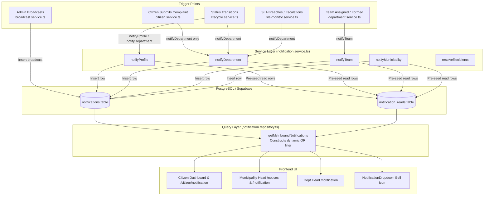

# In-Depth Notification Flow Analysis & Complete Implementation Plan
**Reference Document**: [`docs/notification.txt`](file:///d:/Smart-Civic-Platform/docs/notification.txt)  
**System**: Smart Civic Grievance & Municipal Management Platform  
**Target Roles**: Citizen, Staff, Department Head, Municipality Head, Superadmin  

---

## 1. Executive Summary

This document provides a comprehensive audit of the **current notification flow** in the codebase compared against the architectural requirements specified in [`docs/notification.txt`](file:///d:/Smart-Civic-Platform/docs/notification.txt). 

The core principle established in [`docs/notification.txt`](file:///d:/Smart-Civic-Platform/docs/notification.txt) is that the notification system must be a **role-based, event-driven, strictly isolated communication system**:
- **Municipality Isolation**: Citizens and staff of Municipality A must **never** receive notifications from Municipality B.
- **Department Isolation**: Staff and department heads must not receive notifications from unrelated departments unless explicitly cross-assigned.
- **Team-Level Focus**: Field staff should **not** receive every departmental notification; their notifications must focus strictly on their assigned complaints and operational team assignments.
- **Citizen Experience**: Citizens must receive immediate proof of submission (tracking ID, category, date), transparent status changes, resolution details, and rejection reasons.
- **Superadmin Scoping**: Superadmin must be notified of platform-level events, security alerts, and system health—**never** flooded with routine individual complaints.

Our deep-dive code review revealed **7 critical architectural defects** in the current implementation that cause municipality cross-talk, missing citizen confirmations, broken notification navigation, and missing staff views.

---

## 2. Current Notification Flow (As Implemented Today)

### 2.1 Backend Architecture



### 2.2 How the Current Code Works
1. **On Complaint Submission (`citizen.service.ts:159`)**:
   - The backend calls `notifService.notifyDepartment(routing.lead_department_id, ...)`.
   - It inserts a notification with `audience: "department"` and `target_department_id: lead_department_id`.
   - It loops through all staff members in the department and creates `notification_reads` rows for each.
2. **On Complaint Status Change (`lifecycle.service.ts:130`)**:
   - For citizen: calls `notifService.notifyProfile(complaint.citizen_id, ...)` for `resolved`, `in_progress`, `assigned`, `closed`, and `rejected`.
   - For department: calls `notifService.notifyDepartment(...)` on `reopened` or `escalated`.
3. **On Team Assignment (`department.service.ts:485`)**:
   - Calls `notifService.notifyTeam(team.id, "New Field Assignment", ...)` and `lifecycle.transition(..., "assigned")`.
4. **On Querying Inbound Notifications (`notification.repository.ts:23`)**:
   - Checks user profile (`role`, `municipality_id`, `department_id`).
   - Builds SQL `OR` clauses (`target_profile_id = user.id`, `audience = everyone`, `target_team_id IN (...)`).

---

## 3. Deep-Dive Gap Analysis & Critical Issues Identified

### Issue 1: Municipality Isolation Leak (High Severity)
- **Problem**: In [`notification.repository.ts:53`](file:///d:/Smart-Civic-Platform/Smart_Civic_Platform_Backend/src/modules/notification/repository/notification.repository.ts#L53):
  ```ts
  if (role === "citizen") {
    orConditions.push("audience.eq.all_citizens"); // <-- Unscoped by municipality!
  ```
  And in [`notification.repository.ts:41`](file:///d:/Smart-Civic-Platform/Smart_Civic_Platform_Backend/src/modules/notification/repository/notification.repository.ts#L41):
  ```ts
  const orConditions: string[] = [`target_profile_id.eq.${userId}`, `audience.eq.everyone`]; // <-- Unscoped!
  ```
- **Consequence**: When Municipality A publishes an announcement or broadcast for `all_citizens` or `everyone`, citizens in Municipality B, C, etc. will also receive and see it in their notification feed!
- **Violation**: Violates Section 6 of `notification.txt`: *"A citizen from Municipality B should not receive it... Municipality separation should exist at the data, authorization, backend, and notification levels."*

---

### Issue 2: Missing Citizen Submission Confirmation (High Severity)
- **Problem**: In [`citizen.service.ts:157-165`](file:///d:/Smart-Civic-Platform/Smart_Civic_Platform_Backend/src/modules/citizen/services/citizen.service.ts#L157-L165):
  ```ts
  // 8. Trigger notification
  const notifService = new NotificationService(supabaseAdmin);
  await notifService.notifyDepartment(
    routing.lead_department_id,
    "New Grievance Submitted",
    `New grievance '${payload.title}' (${trackingId}) assigned to your department.`
  );
  ```
  Only the department is notified. **No notification is ever dispatched to the citizen who filed the complaint.**
- **Violation**: Violates Section 1 of `notification.txt`: *"When a citizen successfully submits a complaint, the system should immediately send a confirmation notification telling them that the complaint has been received, together with the complaint reference number, submission date, category, and current status. This gives the citizen proof that the complaint was successfully registered."*

---

### Issue 3: Missing Municipality Head Submission Oversight (Medium Severity)
- **Problem**: When a citizen submits a complaint, only the assigned department head receives an alert. The Municipality Head and municipal oversight administrators are completely bypassed.
- **Violation**: Violates Section 4 of `notification.txt`: *"When a citizen submits a complaint to the municipality, the municipality's responsible administrative users should receive a notification... so they can coordinate the appropriate response."*

---

### Issue 4: `complaint_id` Missing in Team & Status Notifications (Breaking UI Navigation)
- **Problem**: In [`notification.service.ts:282-323`](file:///d:/Smart-Civic-Platform/Smart_Civic_Platform_Backend/src/service/notification.service.ts#L282-L323):
  `notifyTeam`, `notifyDepartment`, and `notifyProfile` do **not** take or insert `complaint_id` into the `notifications` table!
- **Consequence**:
  In [`NotificationInbox.tsx:72`](file:///d:/Smart-Civic-Platform/Smart_Civic_Platform_Frontend/src/components/notification/NotificationInbox.tsx#L72) and [`NotificationDropdown.tsx:48`](file:///d:/Smart-Civic-Platform/Smart_Civic_Platform_Frontend/src/components/notification/NotificationDropdown.tsx#L48):
  ```ts
  if (notif.complaint_id) {
    navigate(`/citizen/complaints/${notif.complaint_id}`);
  }
  ```
  Because `notif.complaint_id` is always `null` or `undefined`, clicking on any complaint notification in the dropdown or inbox **fails to navigate to the complaint detail page**.

---

### Issue 5: Staff Member Notification Spam (Department Flooding)
- **Problem**: In [`notification.service.ts:57-64`](file:///d:/Smart-Civic-Platform/Smart_Civic_Platform_Backend/src/service/notification.service.ts#L57-L64) and [`notification.repository.ts:117`](file:///d:/Smart-Civic-Platform/Smart_Civic_Platform_Backend/src/modules/notification/repository/notification.repository.ts#L117):
  When a department notification is created, it pre-seeds read entries for every staff member in that department, and staff repositories match `target_department_id.eq.${staff.primary_department_id}`.
- **Consequence**: Field workers (plumbers, road repairers, sanitation crews) get spammed with every initial triage notification, management SLA warning, and unassigned grievance in their department before any team assignment is made.
- **Violation**: Violates Section 2 & 8 of `notification.txt`: *"The Staff notification system should be focused on work that the staff member or their assigned team needs to perform. Staff should not receive every notification generated by their department."*

---

### Issue 6: Missing Staff Notification Route on Frontend (404 Error)
- **Problem**: In [`NotificationDropdown.tsx:35`](file:///d:/Smart-Civic-Platform/Smart_Civic_Platform_Frontend/src/components/notification/NotificationDropdown.tsx#L35):
  When any user clicks "View All Notifications", the app executes:
  ```ts
  navigate(`/${role}/notification`);
  ```
  For staff, this navigates to `/staff/notification`.
  However, in [`AppRoutes.tsx:158-185`](file:///d:/Smart-Civic-Platform/Smart_Civic_Platform_Frontend/src/routes/AppRoutes.tsx#L158-L185), **there is no route defined for `/staff/notification`**!
- **Consequence**: Staff clicking "View All Notifications" lands on a 404 page or broken redirect.

---

### Issue 7: Notification Type Mismatch Between Backend and Frontend Filter Tabs
- **Problem**:
  In [`NotificationInbox.tsx:87`](file:///d:/Smart-Civic-Platform/Smart_Civic_Platform_Frontend/src/components/notification/NotificationInbox.tsx#L87):
  The UI filters the "Grievances" tab using `['complaint_update', 'assignment', 'handoff']`.
  However, the backend database enum in [`Supabase_Schema.sql:55`](file:///d:/Smart-Civic-Platform/supabase/Supabase_Schema.sql#L55) defines:
  `'team_assignment'` (NOT `'assignment'`).
- **Consequence**: When a team assignment notification is received by staff, selecting the "Grievances" tab filters it out because the type strings do not match!

---

### Issue 8: Superadmin Notification Flooding
- **Problem**: In [`notification.repository.ts:51`](file:///d:/Smart-Civic-Platform/Smart_Civic_Platform_Backend/src/modules/notification/repository/notification.repository.ts#L51):
  `if (role === "superadmin") orConditions.push("audience.eq.all_citizens", "audience.eq.all_staff", "type.eq.system");`
  Superadmin sees routine broadcasts and system notifications from every municipality.
- **Violation**: Violates Section 5 of `notification.txt`: *"Sending the Superadmin a notification every time a citizen submits, updates, or resolves a complaint would make the notification system almost useless... Superadmin notifications should focus on system-level, security-level, administrative, and exceptional events."*

---

## 4. Target Role-Based Notification Flow Matrix

To satisfy [`docs/notification.txt`](file:///d:/Smart-Civic-Platform/docs/notification.txt), here is the exact event-to-role dispatch matrix:

| Event | Citizen | Assigned Staff / Team | Department Head | Municipality Head | Superadmin |
| :--- | :--- | :--- | :--- | :--- | :--- |
| **Grievance Submitted (Normal)** |  **Proof of Submission** (tracking ID, category, date) | ❌ |  **New Grievance in Department** | ℹ️ Optional summary / oversight | ❌ |
| **Grievance Submitted (Urgent/Emergency)** |  **Urgent Submission Confirmation** | ❌ |  **HIGH PRIORITY Emergency Grievance** |  **HIGH PRIORITY Municipal Emergency** | ❌ (unless multi-municipality) |
| **Grievance Assigned to Team** | ℹ️ **Status: Assigned** (internal names hidden) |  **Assignment Notification** (with tracking ID & link) | 📝 Retained in audit queue | ❌ | ❌ |
| **Status: In Progress** |  **Status: Work in Progress** | ❌ (Staff initiated it) | ℹ️ Status Update | ❌ | ❌ |
| **Additional Info Requested** |  **Action Required: Details Needed** | ❌ | ❌ | ❌ | ❌ |
| **Citizen Provides Info / Evidence** | ❌ |  **Citizen Provided Updates** | ℹ️ Info Added | ❌ | ❌ |
| **Grievance Marked Resolved** |  **Grievance Resolved** (with resolution notes & link) | ❌ |  **Verification / Review Request** | ℹ️ Resolution Metric | ❌ |
| **Grievance Rejected** |  **Grievance Rejected** (with required rejection reason) | ❌ |  **Rejection Audit** | ❌ | ❌ |
| **Citizen Reopens Grievance** |  **Reopen Recorded Confirmation** |  **Previous Complaint Reopened** |  **Action Required: Complaint Reopened** | ℹ️ Reopen Metric | ❌ |
| **SLA Warning / Escalation** | ❌ | ⚠️ **SLA Warning** | ⚠️ **SLA Warning / Escalation** |  **SLA Escalation Alert** | ❌ |
| **Municipal Emergency Announcement** |  **Public Emergency Alert** (scoped to ward/muni) |  **Public Emergency Alert** |  **Emergency Alert** |  **Emergency Alert** | ℹ️ Multi-muni alert |
| **System Security / Health Failure** | ❌ | ❌ | ❌ | ❌ |  **Security / System Health Alert** |

---

## 5. In-Depth Step-by-Step Implementation Plan

### Phase 1: Database Schema & Type Alignment
1. **Add `priority` Column to `notifications` Table**:
   - Currently, `notifications` only has `is_urgent BOOLEAN`.
   - Add `priority` text column or enum (`'normal'`, `'important'`, `'emergency'`) with default `'normal'`.
2. **Ensure `complaint_id` Foreign Key Support**:
   - Verify `notifications.complaint_id` references `complaints.co_uid` and is indexed for performance.

---

### Phase 2: Refactoring `NotificationService` ([`src/service/notification.service.ts`](file:///d:/Smart-Civic-Platform/Smart_Civic_Platform_Backend/src/service/notification.service.ts))
1. **Update Method Signatures to Always Accept Context Metadata**:
   ```ts
   interface NotificationOptions {
     complaintId?: string;
     municipalityId?: string;
     departmentId?: string;
     teamId?: string;
     wardId?: string;
     priority?: 'normal' | 'important' | 'emergency';
     isUrgent?: boolean;
   }
   ```
2. **Fix `notifyProfile`**:
   - Store `complaint_id`, `target_municipality_id`, and `priority` on the notification record.
3. **Fix `notifyDepartment` (Management Isolation)**:
   - Only pre-seed read entries for the **Department Head** (`head_profile_id` and profiles with `role = 'department_head'` in that department).
   - Stop pre-seeding entries for ordinary field staff in `notifyDepartment`.
4. **Fix `notifyTeam` (Link Complaint & Navigate)**:
   - Store `complaint_id`, `target_municipality_id`, and `target_department_id`.
   - Pre-seed entries for all current active members in `team_members`.
5. **Fix `notifyMunicipality`**:
   - Scope to `role = 'municipality_head'` and authorized oversight profiles in that specific municipality.

---

### Phase 3: Refactoring `NotificationsRepository` ([`src/modules/notification/repository/notification.repository.ts`](file:///d:/Smart-Civic-Platform/Smart_Civic_Platform_Backend/src/modules/notification/repository/notification.repository.ts))
1. **Enforce Strict Municipality Isolation**:
   - For `citizen`: Only match `target_municipality_id.eq.${citizenMuniId}` when querying `audience.in.(all_citizens,everyone)`.
   - Remove global `audience.eq.everyone` and `audience.eq.all_citizens` without a municipality filter.
2. **Enforce Team-Level Staff Isolation**:
   - For `staff`: Only match:
     1. `target_profile_id.eq.${userId}`
     2. `target_team_id.in.(${staffTeamIds})`
     3. `and(target_municipality_id.eq.${staffMuniId},audience.eq.all_staff)`
   - Remove blanket `target_department_id.eq.${primary_dept_id}` from ordinary staff so they don't get flooded with department management notices.
3. **Enforce Superadmin Scoping**:
   - Superadmin only receives `target_profile_id.eq.${userId}`, `type.in.(system,security,infrastructure)`, and system-wide emergency alerts.

---

### Phase 4: Integrating Missing Lifecycle Triggers
1. **Citizen Complaint Submission Confirmation ([`citizen.service.ts`](file:///d:/Smart-Civic-Platform/Smart_Civic_Platform_Backend/src/modules/citizen/services/citizen.service.ts))**:
   - In `submitComplaint`, immediately dispatch `notifyProfile` to `citizenId`:
     - Title: `Complaint Submitted — #${trackingId}`
     - Body: `Your complaint '${complaintTitle}' has been registered under ${categoryName}. Our municipal team will review it shortly.`
     - Metadata: `complaintId: complaint.co_uid`, `priority: resolvedSeverity === 'urgent' ? 'emergency' : 'normal'`.
   - If `resolvedSeverity === 'urgent'`, also dispatch `notifyMunicipality(location.municipality_id, "URGENT Complaint Alert", ...)`.
2. **Citizen Reopen Confirmation ([`lifecycle.service.ts`](file:///d:/Smart-Civic-Platform/Smart_Civic_Platform_Backend/src/service/lifecycle.service.ts))**:
   - When citizen reopens a complaint, notify citizen that the reopen request was successfully logged, and notify both the previous assigned team and department head.
3. **Citizen Additional Info / Message Added ([`citizen.service.ts`](file:///d:/Smart-Civic-Platform/Smart_Civic_Platform_Backend/src/modules/citizen/services/citizen.service.ts))**:
   - When citizen submits additional evidence or discussion message, notify the assigned team so staff does not need to manually poll.

---

### Phase 5: Frontend Integration & Route Fixes
1. **Add Staff Notification Route ([`AppRoutes.tsx`](file:///d:/Smart-Civic-Platform/Smart_Civic_Platform_Frontend/src/routes/AppRoutes.tsx))**:
   - Add `<Route path="/staff/notification" element={<Notifications />} />` under staff protected routes.
2. **Fix Tab Filter in `NotificationInbox.tsx` ([`NotificationInbox.tsx`](file:///d:/Smart-Civic-Platform/Smart_Civic_Platform_Frontend/src/components/notification/NotificationInbox.tsx))**:
   - Update tab filter to match both `'team_assignment'` and `'assignment'`:
     ```ts
     if (tab === 2) return ['complaint_update', 'team_assignment', 'assignment', 'handoff'].includes(n.type);
     ```
3. **Enable Direct Navigation on Click ([`NotificationInbox.tsx`](file:///d:/Smart-Civic-Platform/Smart_Civic_Platform_Frontend/src/components/notification/NotificationInbox.tsx) & [`NotificationDropdown.tsx`](file:///d:/Smart-Civic-Platform/Smart_Civic_Platform_Frontend/src/components/notification/NotificationDropdown.tsx))**:
   - Since `complaint_id` will now be passed in backend notifications, clicking the item will seamlessly open the complaint detail page for the respective role.
4. **Visual Distinction for Priorities**:
   - Add visual badges (`Normal` chip, `Important` yellow badge, `Emergency` pulsing red chip) so users don't rely only on basic colors.

---

## 6. Verification & Automated Testing Plan

### 6.1 Automated Isolation Tests
1. **Cross-Municipality Test**:
   - Create a citizen in Tokha (`5cfd0792...`) and a citizen in Paiyun (`5fe44511...`).
   - Broadcast an `all_citizens` notification targeting Tokha.
   - Assert Tokha citizen receives the notification; assert Paiyun citizen receives **0** notifications.
2. **Staff Department Spam Test**:
   - Create a Department Head and a field Staff member in Tokha Sanitation.
   - Submit a new complaint to Tokha Sanitation.
   - Assert Department Head receives `New Grievance Submitted`.
   - Assert field Staff member receives **0** notifications (until assigned to a team).
3. **Team Assignment Test**:
   - Assign complaint to Team A.
   - Assert members of Team A receive `New Field Assignment` with `complaint_id`.
   - Assert clicking the notification links directly to `/staff/complaint/:id`.
4. **Citizen Submission Confirmation Test**:
   - Citizen submits a complaint.
   - Assert citizen's `/api/notifications` immediately includes `Complaint Submitted — #${trackingId}`.

### 6.2 Build Validation
- Run `npm run build` in `Smart_Civic_Platform_Backend` (`tsc`).
- Run `npm run build` in `Smart_Civic_Platform_Frontend` (`vite build`).
